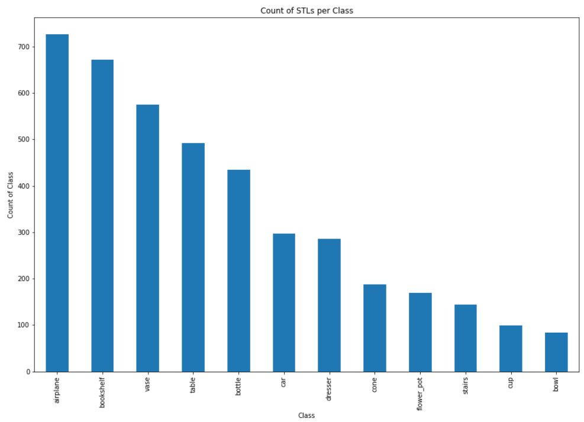
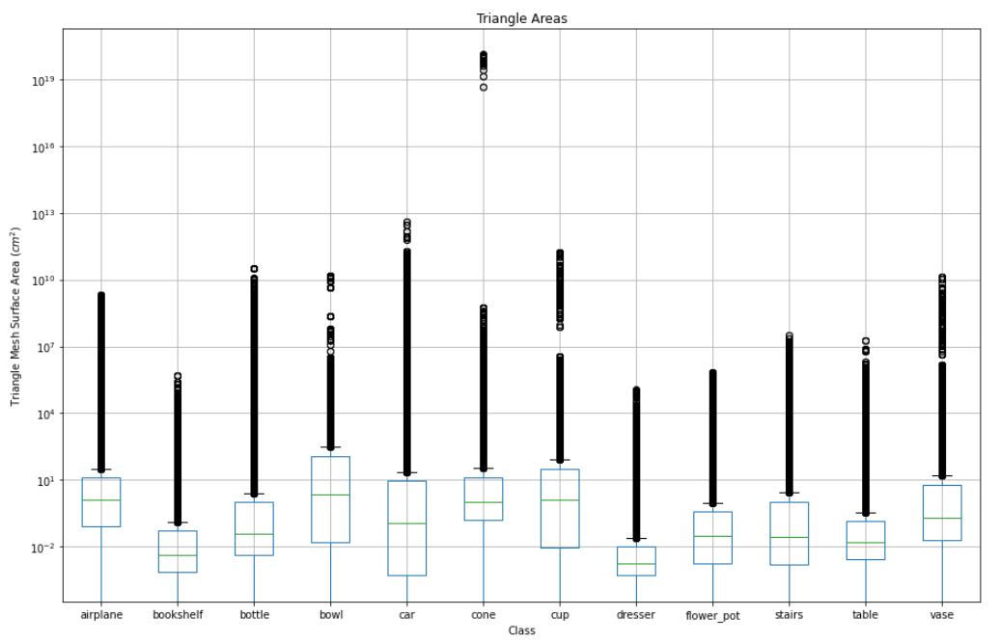

<!---
Designed by:
Chris Botzoc
Grant Fass
Edited by:
John Bukowy
--->
 
# Summary Information
We are combining two different data sources, Thingiverse and ModelNet40, which will both be described below.
 
The entire collected dataset will be refered to as "Thinginet 12".
 
## Thingiverse
| Field             | Description                        |
| ----------------- | ---------------------------------- |
| Name              | ModelNet40 |
| Curation Date     | 2015 |
| Sensitivity Level | 0 |
| Summary           | The dataset known as ModelNet40 features 12,311 pre-aligned shapes spanning 40 different categories, with 9,843 shapes (80%) for training and 2,468 shapes (20%) for testing. These shapes are stored in the Object File Format (OFF). The dataset was collected by Princeton and is globally available to researchers in computer vision, machine learning, data mining, computer graphics, robotics, and more, due to it's open source nature. |
| Source            | [Kaggle](https://www.kaggle.com/datasets/balraj98/modelnet40-princeton-3d-object-dataset), [PrinceTon](https://modelnet.cs.princeton.edu/)|
| Paper             | [Original](https://3dvision.princeton.edu/projects/2014/3DShapeNets/paper.pdf) |
 
## ModelNet40
| Field             | Description                        |
| ----------------- | ---------------------------------- |
| Name              | Thingiverse |
| Curation Date     | 10/18/2008 - current |
| Sensitivity Level | 0 |
| Summary           | Thingiverse is a digital repository for user-generated designs, predominantly in three-dimensional (3D) printing and computer-aided design (CAD). Thingiverse serves as a communal space where individuals share, access, and collaborate on digital designs. Users contribute to Thingiverse by uploading their designs, often accompanied by detailed specifications and instructions. The 3D models are shared publicly, so anyone can download and print the models, and there's a public API available for those wishing to pull files programatically (like us). |
| Source            | [https://www.thingiverse.com/](https://www.thingiverse.com/) |
 
## ThingiNet 12
| Field             | Description                        |
| ----------------- | ---------------------------------- |
| Name              |  Thinginet12 |
| Curation Date     | 2/4/24  |
| Sensitivity Level |  0 |
| Summary           | Thinginet12 is a compilation of ModelNet40 3D models and the top 10 pages of models for each category within the base ModelNet40 dataset. To limit scope, the combined dataset has been pruned to only 12 categories (Car, Plane, Flower Pot, Stairs, Vase, Cup, Bowl, Bookshelf, Bottle, Chair, Cone, and Dresser).  Each category of models used in Thinginet12 was selected through human analysis of the similarity of scraped models to the expeced base ModelNet40 models.|
 
# Card Authors
| Name | Email |
| ---- | ---- |
| Thomas Benzshawel   | benzshawelt@msoe.edu |
| Mitchell Johsntone  | johnstonem@msoe.edu |
 
 
<!-- # Known Sensitive Features
*This may not apply to all data sets, but this makes newcomers to the data aware of potential risks of IP exposure. For example, if you are using a dataset that has patient history information (PHI) you would not want to publicly release the data.*
 
| Feature Name | Sensitive Type | Risk Reduction Method |
| ---- | ---- | ---- |
|  |  |  | -->
 
# Data Overview
| Field | Value |
| ---- | ---- |
| Storage Size (Thingiverse) | 38 GB |
| Storage Size (ModelNet) | 20 GB |
| Data Format (thingiverse) | .stl |
| Data Format (ModelNet) | .off / .stl |
| Average STL File Size (Thingiverse) | 1.977 MB |
| Average STL File Size (ModelNet) | 876 KB |
| Average OFF File Size (ModelNet) | 794 KB |
| Number of Classes | 12 |
| Minimum Number of Observations* per Class (Thingverse)| 106 |
| Minimum Number of Observations* per Class (ModelNet)| 106 |
 
* Number of observations was found by exploring the minimum number of models scraped from a category on thingiverse. All observation counts for each of the 12 classes are listed below: (114, 118, 118, 117, 112, 115, 119, 113, 106, 126, 116, 109 )
 
# Numerical Features Summary
## ModelNet40
 
|Feature    |count  |mean   |std    |min    |25%    |50%    |75%    |max    |
|--|--|--|--|--|--|--|--|--|
|Volume (cm^3)  |4166.0 |3.126468e+24   |2.017965e+26   |-4.697008e+14  |1.776357e-17   |1.052299   |58.943707  |1.302486e+28 |
|Mass (kg)  |4166.0 |3.908085e+24   |2.522456e+26   |-5.871260e+14  |2.220446e-17   |1.315374   |73.679633  |1.628108e+28 |
|Surface Area (cm^2)    |4166.0 |9.482345e+15   |6.120338e+17   |1.116434e-05   |3.727397e+01   |197.710241 |3163.017393    |3.950345e+19 |
|Triangle Areas (cm^2)  |108567755.0    |3.638599e+13   |5.896169e+16   |0.0    |0.006991   |0.269013   |6.696606   |1.326251e+20   |
|X Coordinate   |325703265.0    |14851.619552   |1.723443e+07   |-6.029160e+08  |-0.296874  |67.274300  |812.887024 |4.440780e+10   |
|Y Coordinate   |325703265.0    |24319.053720   |3.247004e+07   |-6.270230e+05  |1.258510   |144.979996 |965.018982 |6.845180e+10   |
|Z Coordinate   |325703265.0    |4049.226268    |6.802323e+06   |-3.040390e+04  |11.240300  |70.473000  |181.860001 |2.455200e+10   |
 
## Thingiverse
 
|Feature    |count  |mean   |std    |min    |25%    |50%    |75%    |max    |
|--|--|--|--|--|--|--|--|--|
|Volume (cm^3)  |2205.0 |1173.620954    |24967.319141   |-1720.301791   |4.074912   |18.100443  |77.248918  |8.140099e+05   |
|Mass (kg)  |2205.0 |1467.026192    |31209.148927   |-2150.377238   |5.093640   |22.625554  |96.561147  |1.017512e+06   |
|Area (cm^2)    |2205.0 |692.231452 |9047.533096    |0.000000   |41.169387  |113.257663 |358.034149 |2.822914e+05   |
|Triangle Areas (cm^2)  |224417140.0    |0.680149   |19.152118  |0.0    |0.003059   |0.020178   |0.131368   |51982.750491   |
|X Coordinate   |673251420.0    |51.983957  |299.406984 |-1260.844849   |-10.862483 |11.786585  |43.436001  |47258.824219   |
|Y Coordinate   |673251420.0    |22.171054  |166.643292 |-2255.997803   |-11.645494 |8.658835   |40.456631  |46411.863281   |
|Z Coordinate   |673251420.0    |39.775096  |165.244964 |-3557.038330   |4.700470   |18.361500  |52.037594  |1432.030029    |
 
# Categorical Features Summary
| Feature | Unique Values | Most Common Value |
| ------- | ------------- | ----------------- |
|    Tags |   3D_UAV, airplane, radioshack, RC_airplane, plane, keychain, can, Canetter, door glove pocket, pliable, bladerunner, scifi, spinner, car, etc... | The Class Name (airplane, bookshelf, bottle, etc...) |
 

 
# Example Entries
## Example STL File contents:
 

$\dots$ Repeated Facets

 
## Example Point values:
 
|Class  |X   |Y  |Z  |
|--|--|--|--|
|airplane   |7.57019    |102.410004    |27.026300 |
|airplane   |7.57019    |102.819000    |26.499201 |
|airplane   |12.04780   |104.056000   |28.295099    |
|airplane   |7.57019    |102.819000    |26.499201 |
|airplane   |7.57019    |102.410004    |27.026300 |
 
## Example 3D Models
 
An average model usually has one solid form: [bottle_0005 from ModelNet](/data/csc4801/KedzioraLab/ModelNet40/bottle/train/stl/bottle_0005.stl)
 

 
Some models are split up into many pieces. These are mostly found in the Thingiverse dataset, as they use multiple prints that interlock for some projects.
As an example, a lot of thingiverse airplane projects are split into multiple sub-components, like below.
 
These parts are from Thingiverse: [RC_airplane_100%_3D_printable_plane_DIY_-_eSUN_PLA_LW](/data/csc4801/KedzioraLab/thingiverse/airplane/stls/RC_airplane_100%_3D_printable_plane_DIY_-_eSUN_PLA_LW)
 

 
# Exploratory Charts
## Count per Categorical class
### ModelNet40:
 

 
### Thingiverse:
 

 
## Triangle Area Distribution
 
### ModelNet
 

 
### Thingiverse
 

 
## STL Surface Area Distribution
### ModelNet
 

 
### Thingiverse
 

 
## STL Mass Distribution
This mass was calculated under the assumption the models are printed with PLA.
### ModelNet
 

 
### Thingiverse
 

 
## STL Volume Distribution
### ModelNet
 

 
### Thingiverse
 

 
## Point Coordinate Value Distribution
### ModelNet
 

 
### Thingiverse
 

 
# Notable Feature Processing
* We are using thingiverse tags to give a context vector for model generation
* **SOME MODELS ARE MULTI-FILE WHILE SOME ARE SINGLE FILE.** This will cause huge issues in training if we do not adequetly inform the model.
* Model descriptions seem useless unless we scrape enought to build an LLM
 
# Notes
- Thingiverse models were scraped used thingiscrape.
- The original ModelNet40 3D Models are given in the OFF format, a standard set by Standford for their models. To standardize our dataset, we've translated them to STL format using the python tool "trimesh".
