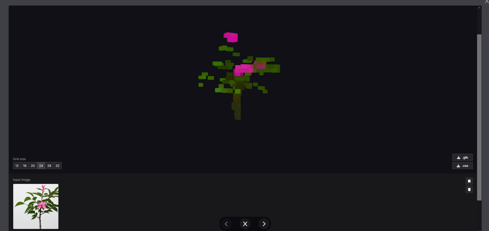

## Things that are adjacent to our aproach
* https://www.designboom.com/technology/onformative-trains-ai-sculpt-3d-models-cube-voxels-12-22-2022/
* https://www.reddit.com/r/VoxelGameDev/comments/1146bhj/aigenerated_voxelized_3d_models/
* https://iliad.ai/canvas
    * 
    * Clearly not ready to 3D Print
* https://drububu.com/miscellaneous/voxelizer/?out=obj
    * Yes, voxelizing an object is essentially solved

* Cheaper Meshy Exists: https://www.sloyd.ai/about
* Meshy: https://www.meshy.ai/
    * Meshy essentially generates a 3D object and then voxelizes it
    * We want to generate a voxel object a-la 3D printer style, then smooth

* ## Seems Very Similar to our aproach
    * https://research.nvidia.com/labs/toronto-ai/xcube/
        * Published at the end of 2023: https://arxiv.org/abs/2312.03806
        * Code Exists: https://github.com/nv-tlabs/XCube
        * Nice Surface reconstruction: https://research.nvidia.com/labs/toronto-ai/NKSR/
            * Code: https://github.com/nv-tlabs/nksr
            

    * https://www.gamedeveloper.com/business/sega-teams-with-ai-startup-eques-on-voxel-generation-tool
    * Text to voxel exists with Meshy: https://www.youtube.com/watch?v=0pIXhOXE1W0

# OUR DATA SET
* https://objaverse.allenai.org/

